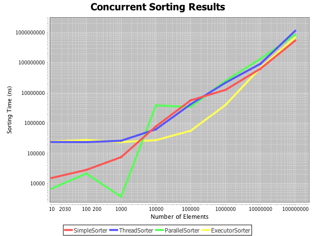

# ConcurrentSorting
Test the performance of concurrent sorting using various strategies.

##Results
All input arrays are sorted in reverse order.
Results are from my machine. See specs below.

[]

### Notes on Sorting Strategies
* SimpleSorter: plain old Arrays.sort
* Parallel Sorter: Arrays.parallelSort
* ThreadSorter: Arrays.sort with two threads using java.lang.Thread
* ExecutorSorter: Arrays.sort with two threads using  java.util.concurrent.ExecutorService

##Interpretation
* All sorting strategies must make a copy of the array, so there is some overhead.
* ThreadSorter and ExecutorSorter make additional copies to split the array in two.
This adds overhead and likely contributes to their poor performance for small array sizes.
* Curiously enough, SimpleSort seems to do just as well as the strategies that
take advantage of multiple threads.
With more cores and larger array sizes, I suspect the results would be much different.
Unfortunately, this repo is currently limited to the specifications of my machine.

##Specs
I am running a MacBook Air with a 1.4 GHz Intel Core i5 processor (2 cores), 8GB ram.

## Dependencies
* JUnit 4.12
* JFreeChart 1.0.19

## Authors
* Austin Kemper
